<div align="center">

</div>

## My Debian Dotfiles
This is my Debian dotfiles (backup). Configuration files, useful scripts and aliases for my work, backgrounds,
notes, color schemes, etc. There are not only dotfiles here, but also some normal files that can be in ```/etc```.

I'm lazy, so there's a script [./init.sh](https://github.com/iikrllx/dotfiles-debian/blob/master/init.sh)
which configure/install my work environment automatically. Installs the necessary programs/packages, configures various
development tools, hotkeys, desktop environment, home directory, etc. I am using the latest stable version
of Debian with Xfce. I like Xfce because there is nothing superfluous in it.

Xfce Desktop:
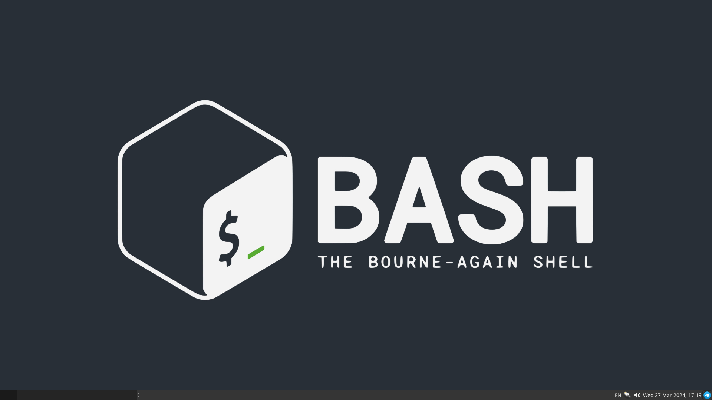
Terminal Emulator with Tmux:
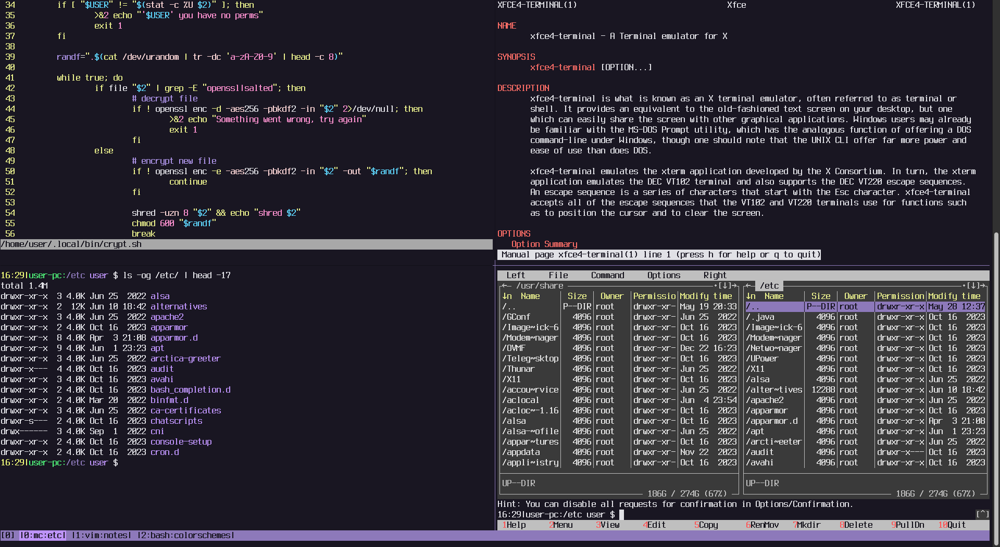

## Description of the environment
- <strong>OS:</strong> ```Debian```
- <strong>DE:</strong> ```Xfce```
- <strong>DM:</strong> ```LightDM```
- <strong>WM:</strong> ```Xfwm4```
- <strong>Shell:</strong> ```Bash```
- <strong>Browser:</strong> ```Firefox```
- <strong>File Manager:</strong> ```Thunar```
- <strong>Text Editor:</strong> ```Vim```, ```Mousepad```
- <strong>Terminal File Navigation:</strong> ```Midnight Commander```
- <strong>Terminal Emulator:</strong> ```xfce4-terminal```
- <strong>Terminal Multiplexer:</strong> ```Tmux```
- <strong>Compiler:</strong> ```GCC```
- <strong>Debuger:</strong> ```GDB Dashboard```
- <strong>Version control system:</strong> ```Git```
- <strong>Text-mode interface for Git:</strong> ```Tig```
- <strong>Mail Client:</strong> ```Neomutt```
- <strong>RSS Feed Reader:</strong> ```Newsboat```
- <strong>Additional packages:</strong> [./init.sh --install-packages](https://github.com/iikrllx/dotfiles-debian/blob/master/init.sh)

## Test all environment
On a clean Debian virtual machine:

```
$ git clone https://github.com/iikrllx/dotfiles-debian.git
$ cd dotfiles-debian
$ ./init.sh --initd --sources.list --install-packages --clean-home --bashrc --bash-completion \
            --xfce --xfce-terminal --mc --tmux --vim --mousepad --gdb --neomutt --newsboat \
            --dircolors --local-bin --local-share
$ reboot
```
Enjoy.

## Install the environment using a script
Usage information:
```
$ ./init.sh --help
```
For example, [initialize](https://github.com/iikrllx/dotfiles-debian/blob/master/init.sh)
[.bashrc](https://github.com/iikrllx/dotfiles-debian/blob/master/.bashrc)
(bash read), [vim](https://github.com/iikrllx/dotfiles-debian/blob/master/.vimrc) and
[tmux](https://github.com/iikrllx/dotfiles-debian/blob/master/.tmux.conf) configurations:
```
$ ./init.sh --bashrc --vim --tmux
```
**Attention**. Be careful when running this script on your main machine, it does not create backup dotfiles and may ~~erase~~ your current working environment.

## Scripts
Location: [.local/bin/](https://github.com/iikrllx/dotfiles-debian/blob/master/.local/bin)

Few examples:<br/>
[mygit.sh](https://github.com/iikrllx/dotfiles-debian/blob/master/.local/bin/mygit.sh) -
manages all my git projects (simple git operations).<br/>
[crypt.sh](https://github.com/iikrllx/dotfiles-debian/blob/master/.local/bin/crypt.sh) -
encrypt/decrypt regular file with sensitive information (using a password).<br/>
[deb-clean.sh](https://github.com/iikrllx/dotfiles-debian/blob/master/.local/bin/deb-clean.sh) -
remove 'rc' (removed but not purged) packages plus debs autoremove and autoclean.<br/>
[checksums.sh](https://github.com/iikrllx/dotfiles-debian/blob/master/.local/bin/checksums.sh) -
wrapper script for 'md5sum' utility. actual to use together with crontab.<br/>

## xfce4-terminal
Installation [Xfce Terminal Emulator](https://github.com/iikrllx/dotfiles-debian/blob/master/.config/xfce4/terminal/terminalrc) configuration with
[colorschemes](https://github.com/iikrllx/dotfiles-debian/tree/master/.local/share/xfce4/terminal/colorschemes) + [dircolors](https://github.com/iikrllx/dotfiles-debian/blob/master/.dircolors).
```
$ ./init.sh --xfce-terminal --dircolors
```

Example of changing the terminal color scheme.

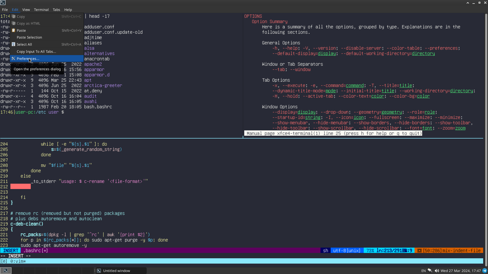
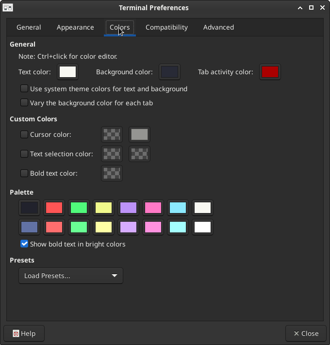
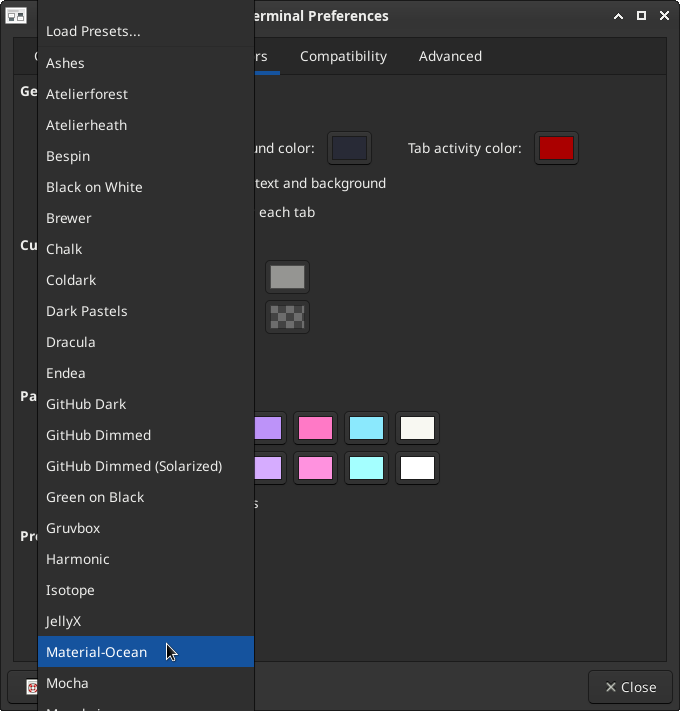
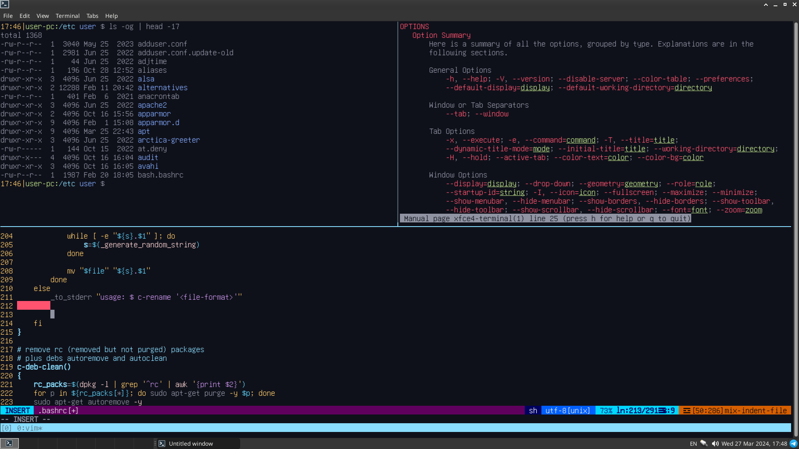

## Application shortcuts
My ```xfce4-keyboard-shortcuts.xml``` [here](https://github.com/iikrllx/dotfiles-debian/blob/master/.config/xfce4/xfconf/xfce-perchannel-xml/xfce4-keyboard-shortcuts.xml)

```
$ ./init.sh --xfce-hotkeys
```

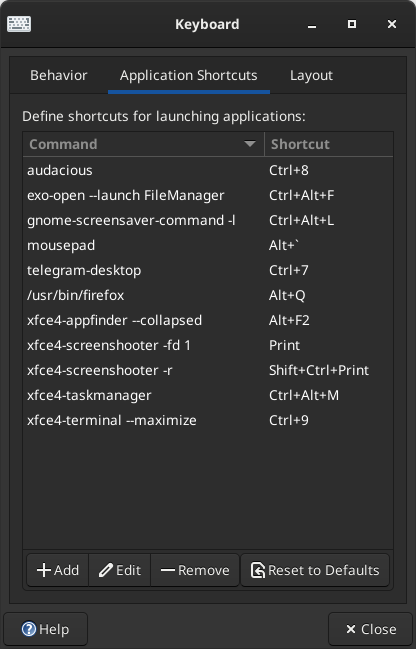

## The best old-school fonts in my opinion
I use these fonts from time to time.<br/>
These fonts are installed using [./init.sh --install-packages](https://github.com/iikrllx/dotfiles-debian/blob/master/init.sh)

```
glass tty vt220 bold
px ibm ega8 regular
px ibm ega9 regular
px ibm mda regular
px ibm vga8 regular
px ibm vga9 regular
terminus medium
unifont regular
unifont-jp regular
hack regular
```

Example of changing the terminal font.

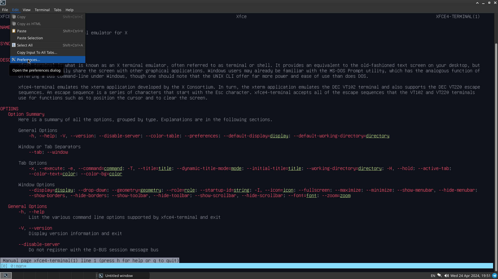
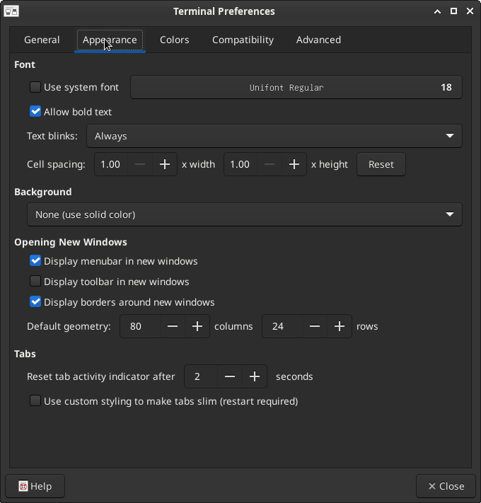
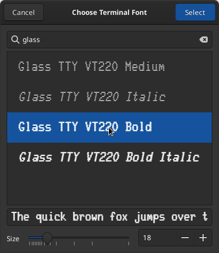
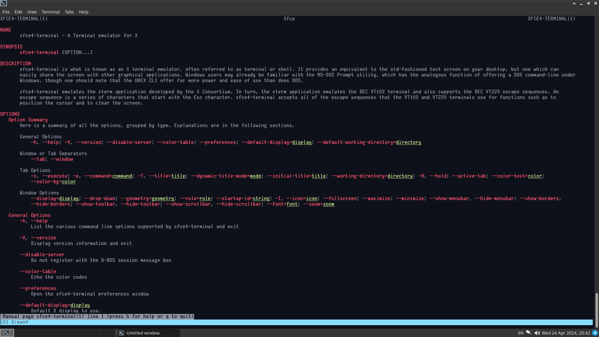

## License
This project is licensed under the GPLv3 License - see the
[LICENSE](https://github.com/iikrllx/dotfiles-debian/blob/master/LICENSE) file for details.
