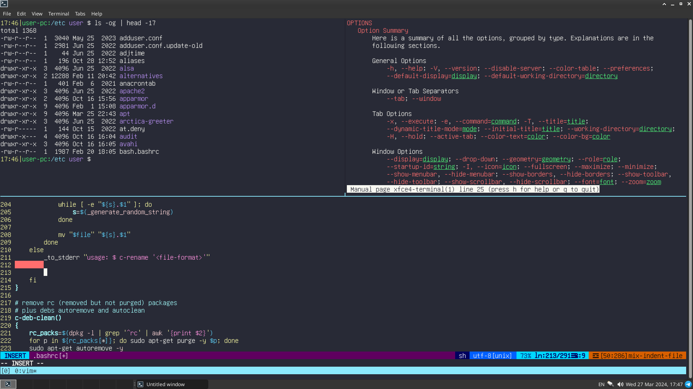

# dotfiles-debian
This is my Debian dotfiles (backup). Configuration files, useful scripts and aliases for my work, backgrounds,
notes, color schemes, etc. There are not only dotfiles here, but also some normal files that can be in ```/etc```.

I'm lazy, so there's a script [./init.sh](https://github.com/iikrllx/dotfiles-debian/blob/master/init.sh)
which configure my work environment automatically. Installs the necessary programs/packages, configures various
development tools, hotkeys, desktop environment, home directory, etc.

I am using the latest stable version of Debian with Xfce. I like Xfce because there is nothing superfluous in it.




## Table of Contents
- [Description of the environment](#description-of-the-environment)
- [Configure environment script](#configure-environment-script)
- [Test all environment](#test-all-environment)
- [Bashrc](#bashrc)
- [Scripts](#scripts)
- [xfce4-terminal](#xfce4-terminal)
- [Session shortcuts](#session-shortcuts)
- [The best old-school fonts in my opinion](#the-best-old-school-fonts-in-my-opinion)

## Description of the environment
- <strong>OS:</strong> ```Debian```
- <strong>DE:</strong> ```Xfce```
- <strong>DM:</strong> ```LightDM```
- <strong>WM:</strong> ```Xfwm4```
- <strong>Shell:</strong> ```Bash```
- <strong>Browser:</strong> ```Firefox```
- <strong>File Manager:</strong> ```Thunar```
- <strong>Text:</strong> ```Vim, Mousepad, MC```
- <strong>Terminal:</strong> ```xfce4-terminal, Tmux```
- <strong>Compiler:</strong> ```GCC```
- <strong>Debuger:</strong> ```GDB Dashboard```
- <strong>Version control system:</strong> ```Git```
- <strong>Text-mode interface for git:</strong> ```Tig```
- <strong>Mail Client:</strong> ```neomutt```
- <strong>Additional packages:</strong> [./init.sh --packages](https://github.com/iikrllx/dotfiles-debian/blob/master/init.sh)

## Configure environment script
```
$ ./init.sh --help
Usage: init.sh [option]

  [option]
  --ftp                  ftp server configuration
  --hosts                modify hosts
  --sysctl               modify kernel parameters
  --initd                init.d script (operations before shutdown/reboot)
  --packages             install packages
  --clean-home           cleanup home directory
  --bashrc               ~/.bashrc extra rules
  --bash-completion      enable bash completion
  --locales              generate 'en_US' 'ru_RU' locales
  --xfce                 xfce configuration
  --xfce4-terminal       xfce4-terminal configuration
  --mc                   midnight commander configuration
  --tmux                 tmux configuration
  --vim                  vim configuration with plugins
  --mousepad             mousepad configuration
  --gdb                  gdb configuration
  --other                other operations
  -h, --help             show this help and exit
```

For example, [configure](https://github.com/iikrllx/dotfiles-debian/blob/master/init.sh)
[.bashrc](https://github.com/iikrllx/dotfiles-debian/blob/master/.bashrc)
(bash read), [vim](https://github.com/iikrllx/dotfiles-debian/blob/master/.vimrc) and
[tmux](https://github.com/iikrllx/dotfiles-debian/blob/master/.tmux.conf):
```
$ ./init.sh --bashrc --vim --tmux
```

## Test all environment
On a clean Debian virtual machine:

```
$ git clone https://github.com/iikrllx/dotfiles-debian.git
$ cd dotfiles-debian
$ ./init.sh --packages --initd --clean-home --bashrc --bash-completion --mc \
            --xfce --xfce4-terminal --tmux --vim --mousepad --gdb --other
$ reboot
```
Enjoy.

## Bashrc
Functions:

```
$ c-tm
$ c-tmr
```
I use these functions as a timer with a signal.
Remind myself of something.

---

```
$ c-cc
```
Clear the clipboard.

---

```
$ c-rnd-0
$ c-rnd-1
```
Generate random symbols.<br/>
c-rnd-0 (12 a-z0-9 symbols to clipboard)<br/>
c-rnd-1 (28 a-zA-Z0-9 symbols to stdout)<br/>

---

```
$ c-rename
```
Renames all files to random names in current directory. For example:
```
$ ls
a.txt  b.txt  my-secrets.txt  secret.txt

$ c-rename "txt"
$ ls
1z2otasm1idc.txt  7ixi4wocijea.txt  ttowy8plqm2y.txt  x74gy8x7si42.txt
```

---

```
$ c-deb-clean
```
I like use this function for clean 'rc' packages, debs autoremove and autoclean.

---

```
$ c-sd
$ c-rb
```
Shutdown and reboot.

---

```
$ c-vb
```
Vim open ~/vbuf file.<br/>
This file has saved lines from the clipboard.<br/>

---

## Scripts
[mygit.sh](https://github.com/iikrllx/dotfiles-debian/blob/master/.local/bin/mygit.sh) -
this script manage all my git projects (simple git operations).<br/>
[crypt.sh](https://github.com/iikrllx/dotfiles-debian/blob/master/.local/bin/crypt.sh) -
this script encrypt/decrypt regular file with sensitive information (using a password).<br/>
[skeleton.sh](https://github.com/iikrllx/dotfiles-debian/blob/master/.local/bin/skeleton.sh) -
prepare the skeleton of the C source code.<br/>

## xfce4-terminal
Copy files from project to user home directory.
```
$ ./init.sh --xfce4-terminal --other
```

Change terminal color scheme.


## Session shortcuts
```
$ ./init.sh --xfce
```


## The best old-school fonts in my opinion
```
glass tty vt220 bold
px ibm ega8 regular
px ibm ega9 regular
px ibm mda regular
px ibm vga8 regular
px ibm vga9 regular
terminus medium
unifont regular
unifont-jp regular
hack regular
```
