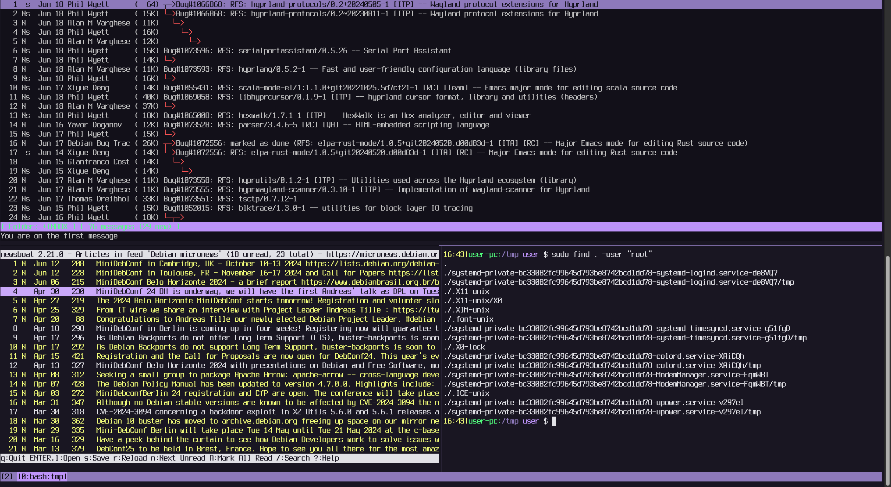

<div align="center">

</div>

## My Debian Dotfiles
This is my Debian dotfiles (backup). Configuration files, useful scripts and aliases for my work, backgrounds,
notes, hotkeys, various development tools, color schemes, etc. There are not only dotfiles here, but also
some normal files that can be in ```/etc```.

I'm lazy, so there's a script [init.sh](https://github.com/iikrllx/dotfiles-debian/blob/master/init.sh)
which initialize/configure my work environment automatically. I am using the latest stable version
of Debian with Xfce.

The repository is updated frequently.

Xfce Desktop (last screenshot):


Terminal Emulator with Tmux (last screenshot):


Another one (last screenshot):


## Description of the environment
- <strong>OS:</strong> ```Debian```
- <strong>DE:</strong> ```Xfce```
- <strong>DM:</strong> ```LightDM```
- <strong>WM:</strong> ```Xfwm4```
- <strong>Shell:</strong> ```Bash```
- <strong>Browser:</strong> ```Firefox```
- <strong>File Manager:</strong> ```Thunar```
- <strong>Text Editor:</strong> ```Vim```, ```Mousepad```
- <strong>Terminal File Navigation:</strong> ```Midnight Commander```
- <strong>Terminal Emulator:</strong> ```xfce4-terminal```
- <strong>Terminal Multiplexer:</strong> ```Tmux```
- <strong>Compiler:</strong> ```GCC```
- <strong>Debuger:</strong> ```GDB Dashboard```
- <strong>Version control system:</strong> ```Git```
- <strong>Text-mode interface for Git:</strong> ```Tig```
- <strong>Mail Client:</strong> ```Neomutt```
- <strong>RSS Feed Reader:</strong> ```Newsboat```
- <strong>Additional packages:</strong> [./init.sh --install-packages](https://github.com/iikrllx/dotfiles-debian/blob/master/init.sh)

## Installation
- Install Debian with Xfce.
- Clone repo:
```
$ git clone https://github.com/iikrllx/dotfiles-debian.git
$ cd dotfiles-debian
```
- Install the environment using a script:

Usage information:
```
$ ./init.sh --help
```
**Attention**. Be careful when running this script on your main machine, it does not create backup dotfiles and may ~~erase~~ your current working environment.

Clean home, update ```/etc/apt/sources.list```, install required packages:
```
$ ./init.sh --clean-home --sources.list --install-packages
```

Configure $HOME environment:
```
$ ./init.sh --bashrc --bash-completion --local-bin --local-share
```

Configure Xfce environment and colors:
```
$ ./init.sh --xfce --xfce-hotkeys --xfce-terminal --dircolors
```

Text editors, terminal multiplexer, debuger, file navigation:
```
$ ./init.sh --vim --tmux --mc --mousepad --gdb
```

Mail client, RSS feed reader:
```
$ ./init.sh --neomutt --newsboat
```

The script has other useful options, but I think you won't need it.

## Scripts
Location: [.local/bin/](https://github.com/iikrllx/dotfiles-debian/blob/master/.local/bin)

Few examples:<br/>
[mygit.sh](https://github.com/iikrllx/dotfiles-debian/blob/master/.local/bin/mygit.sh) -
manages all my git projects (simple git operations).<br/>
[crypt.sh](https://github.com/iikrllx/dotfiles-debian/blob/master/.local/bin/crypt.sh) -
encrypt/decrypt regular file with sensitive information (using a password).<br/>
[deb-clean.sh](https://github.com/iikrllx/dotfiles-debian/blob/master/.local/bin/deb-clean.sh) -
remove 'rc' (removed but not purged) packages plus debs autoremove and autoclean.<br/>
[checksums.sh](https://github.com/iikrllx/dotfiles-debian/blob/master/.local/bin/checksums.sh) -
wrapper script for 'md5sum' utility. actual to use together with crontab.<br/>

## I like these fonts
I use these fonts from time to time in my terminal.<br/>
These fonts are installed using [./init.sh --install-packages](https://github.com/iikrllx/dotfiles-debian/blob/master/init.sh)

```
> glass tty vt220 bold
> px ibm ega8 regular
> unifont regular
> unifont bold
> terminus medium
> terminus bold
> hack regular
```
